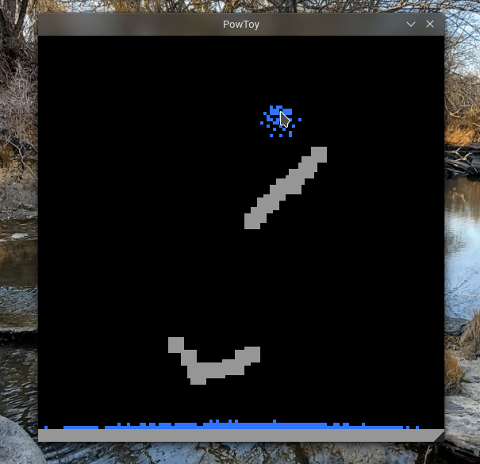

# PowToy

A simple and lightweight cell-based toy. Place stone and water using your mouse (left and right mouse buttons).

## Compiling

The only dependency this uses is SDL2, so make sure your have that package installed. Then compile using `make`. The output binary will be in `bin/pow`